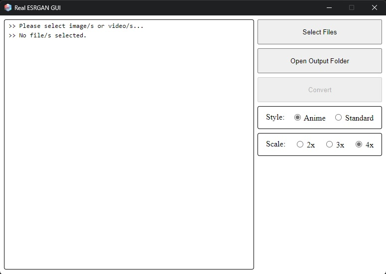

<p align="center">
  
</p>

# Real ESRGAN GUI

- `Real ESRGAN GUI` is a simple, fast and minimalist GUI for [`xinntao's Real-ESRGAN`](https://github.com/xinntao/Real-ESRGAN).
- This allows you to enhance low quality images and videos using AI technology.
- This GUI uses Rust for the backend and JS/HTML/CSS for the frontend using the [`TAURI framework`](https://github.com/tauri-apps/tauri).

> **Warning**
> 
> This is only tested on Windows 11 x64 with NVIDIA RTX 2060.
> 
> Feel free to create an issue for any bugs you might encounter.

# Installation

## With Installer

1. Download Real ESRGAN GUI from the releases section.
2. Double click the MSI installer.
3. Follow the on screen prompts

## Compile yourself

### Dependencies

- [`NodeJS`](https://nodejs.org/en/)
- [`Rust`](https://www.rust-lang.org/)
- [`Tauri`](https://tauri.app/)

1. Clone repo

   ```bash
   git clone https://github.com/rcsaquino/resrgan-gui.git
   cd resrgan-gui
   ```

2. Install dependent packages

   ```bash
   npm install
   ```

3. Download [`xinntao's Real ESRGAN Portable executable files (NCNN)`](https://github.com/xinntao/Real-ESRGAN/releases/download/v0.2.5.0/realesrgan-ncnn-vulkan-20220424-windows.zip)

4. Extract to `~/resrgan-gui/src-tauri/resrgan`.

5. Download [`ffmpeg`](https://www.gyan.dev/ffmpeg/builds/)

6. Extract and copy `ffmpeg.exe` to `~/resrgan-gui/src-tauri/resrgan`

4. Build from `./resrgan-gui`

   ```bash
   cargo tauri build
   ```
5. Your build should be on `~/resrgan-gui/src-tauri/target/release`

You can also customize it how you like. Just edit `~/resrgan-gui/src/App.svelte` for UI customization, and `~/resrgan-gui/src-tauri/src/main.rs` for other backend stuff. You can also run `cargo tauri dev` for hot realoading.

# Contact

If you have any question, please email `rcsaquino.md@gmail.com`

# Acknowledgement

Thanks for all the contributors.

- [`xinntao's Real-ESRGAN`](https://github.com/xinntao/Real-ESRGAN)
- Icon by [`Sunder Muthukumaran`](https://unsplash.com/@sunder_2k25?utm_source=unsplash&utm_medium=referral&utm_content=creditCopyText) on [`Unsplash`](https://unsplash.com/s/photos/icon?utm_source=unsplash&utm_medium=referral&utm_content=creditCopyText)
